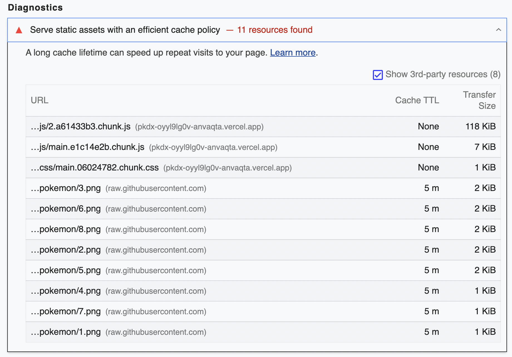

# convert-staticzap

A small (UNOFFICIAL) library to convert raw github/gitlab/etc url's to [Statically.io](https://statically.io/docs/using-staticzap/) CDN url.

(Basically https://statically.io/convert but an npm package)

## Usage

Install

```sh
yarn add convert-staticzap

#or

npm install convert-staticzap
```

Import

```js
import convert from "convert-staticzap";

const slowRawGithubURL =
  "https://raw.githubusercontent.com/PokeAPI/sprites/master/sprites/pokemon/versions/generation-v/black-white/animated/384.gif";
const staticallyURL = convert(slowRawGithubURL);
```

## Supported url

| Source                    | Tested? | example                                                                            |
| ------------------------- | ------- | ---------------------------------------------------------------------------------- |
| raw.githubusercontent.com | ✅      | https://raw.githubusercontent.com/svspicious/wisesa.dev/main/README.md             |
| Github.com blob           | ✅      | https://github.com/svspicious/wisesa.dev/blob/main/public/dino.gif                 |
| Github.com raw            | ✅      | https://github.com/svspicious/wisesa.dev/raw/main/public/preview.png               |
| Gitlab.com blob           | ✅      | https://gitlab.com/gitlab-org/gitlab-svgs/-/blob/main/illustrations/autodevops.svg |
| Gitlab.com raw            | ✅      | https://gitlab.com/gitlab-org/gitlab-svgs/-/raw/main/illustrations/autodevops.svg  |
| Bitbucket                 | ❌      |

More information https://statically.io/docs/using-staticzap/

## Motivation

I was using https://github.com/mazipan/graphql-pokeapi to build [my app](https://github.com/svspicious/pkdx) but the sprites is served from slow github CDN, so i make this library to convert that url to [Statically.io](https://statically.io/docs/using-staticzap/) URL.



## Important links


- [Statically Terms of Service](https://statically.io/policies/terms/)
- [Statically Staticzap](https://statically.io/docs/using-staticzap/)
- [Statically.io web source code](https://github.com/staticallyio/statically)